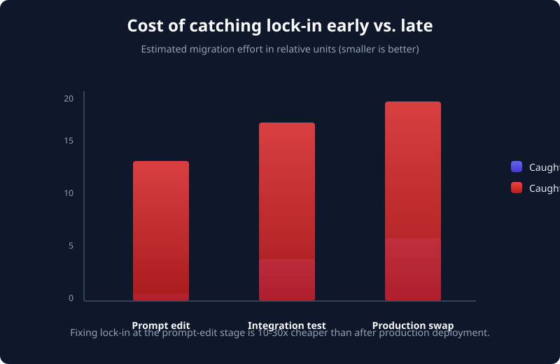
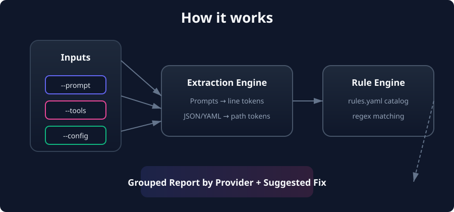
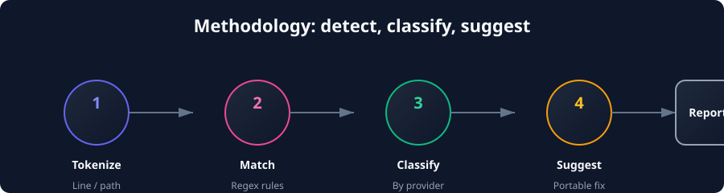
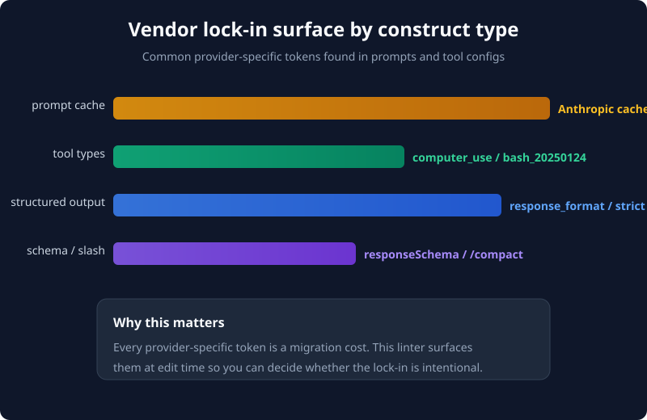

<p align="center">
  
</p>

<p align="center">
  <a href="https://github.com/Victorchatter/prompt-portability-linter/blob/main/LICENSE">
    
  </a>
  
  
  
</p>

# prompt-portability-linter

**A local linter that scans prompts, tool definitions, and agent configs for vendor-locked features — and tells you exactly how to make them portable.**

Multi-provider LLM setups are now the default. A single agent may start on Claude, move to OpenAI, fall back to Gemini, or run locally through Ollama. But prompts and tool definitions quietly accumulate provider-specific tokens: Anthropic `cache_control`, OpenAI `response_format` / `strict`, Gemini `responseSchema`, Codex slash-commands. This linter flags those locks **before** you commit to a vendor, so you can decide whether the lock-in is intentional.

No network calls. No telemetry. No model required. Just a fast, deterministic, rule-based scan.

---

## What problem this solves

You build an agent with a system prompt that works beautifully on Claude:

```markdown
# system.md
You are a senior engineer.

Use cache_control breakpoints to keep these instructions warm.
When calling tools, set response_format to json_schema and strict: true.
For Gemini, provide a responseSchema object.
In the Codex CLI, use /compact after each task.
```

Months later you want to run the same agent on another provider. Now you discover:

- `cache_control` is silently ignored by every non-Anthropic API.
- `response_format` + `strict: true` only works with OpenAI.
- `responseSchema` is a Gemini-only construct.
- `/compact` is a Codex CLI command, not a model instruction.

Rewriting after the fact means re-testing integrations, re-validating outputs, and often re-architecting. The cost grows the later you catch it:

<p align="center">
  
</p>

`prompt-portability-linter` surfaces these issues at the **prompt-edit stage** — when fixing them is a few line changes, not a migration project.

---

## What it does

| Capability | Details |
|---|---|
| **Scans prompts** | `--prompt` files line-by-line for vendor-specific tokens and spelling. |
| **Scans tool definitions** | `--tools` JSON/YAML files are parsed and walked; it catches `computer_use`, `bash_20250124`, `strict: true`, etc. |
| **Scans agent configs** | `--config` JSON/YAML files are treated the same way — many lock-ins live in provider-specific config schemas. |
| **Reports by provider** | Findings are grouped under Anthropic, OpenAI, Gemini, Codex, or any custom provider you add. |
| **Suggests portable alternatives** | Every finding includes a concrete suggestion, not just a flag. |
| **Exits for CI** | Returns `1` when blockers exist, `0` when clean or `--warn-only` is set. |
| **Editable rule catalog** | Rules live in `src/prompt_portability_linter/data/rules.yaml`; add your own with `--rules custom.yaml`. |

---

## How it works

<p align="center">
  
</p>

### Methodology

The linter follows a simple four-step pipeline:

<p align="center">
  
</p>

1. **Tokenize**
   - Prompt files become line-level tokens: `(file, line N, text)`.
   - JSON/YAML tool and config files are parsed and recursively walked; keys, string values, and `key: value` pairs become path-level tokens: `(file, tools[0].type, text)`.

2. **Match**
   - Every token is matched against the rules in `rules.yaml`. Each rule is a regex plus metadata: `locked_to`, `message`, `suggestion`, `severity`.

3. **Classify**
   - Matches are grouped by the `locked_to` provider so the output is easy to read.

4. **Suggest**
   - Each finding carries a portable alternative recommendation. The linter does **not** auto-rewrite; it leaves the design decision to you.

### Why rule-based?

Semantic, model-based detection could catch more subtle forms of lock-in, but it is slower, non-deterministic, and can hallucinate. A curated regex catalog is:

- **Fast** — thousands of lines scan in milliseconds.
- **Transparent** — every rule is inspectable in `rules.yaml`.
- **Extendable** — users add their own rules without retraining anything.
- **CI-friendly** — deterministic exit codes.

---

## Installation

### pipx (recommended)

```bash
pipx install .
```

### From source

```bash
git clone https://github.com/Victorchatter/prompt-portability-linter.git
cd prompt-portability-linter
pip install -e .
```

Requires Python **3.10+**. Zero external dependencies — everything uses the Python standard library.

---

## Quick start

### Lint a single system prompt

```bash
prompt-portability-linter --prompt system.md
```

### Lint a prompt + tools + config

```bash
prompt-portability-linter \
  --prompt system.md \
  --tools tools.json \
  --config agent.json
```

### JSON output for CI

```bash
prompt-portability-linter --prompt system.md --format json
```

### List the built-in rules

```bash
prompt-portability-linter rules
```

### Allow reports without failing the build

```bash
prompt-portability-linter --prompt system.md --warn-only
```

---

## Example: make this prompt portable

### Before — vendor-locked

Save this as `system.md`:

```markdown
# system.md
You are a helpful coding assistant.

Use cache_control breakpoints to keep the long instructions warm in Anthropic's prompt cache.
When you call a function, set response_format to json_schema and strict: true so OpenAI validates the arguments.
For Gemini responses, supply a responseSchema object.
In the Codex CLI, start summaries with /compact.
```

Run the linter:

```text
$ prompt-portability-linter --prompt system.md
anthropic
  system.md:line 3  anthropic-cache-control
    Anthropic prompt cache breakpoints (cache_control) are not portable.
    Suggestion: Remove cache_control blocks; manage context size in application code.

openai
  system.md:line 5  openai-response-format
    OpenAI structured-output response_format is not portable.
    Suggestion: Request plain text or JSON and validate the schema yourself.
  system.md:line 5  openai-strict-functions
    OpenAI function strict mode is not portable.
    Suggestion: Validate tool arguments in application code.

gemini
  system.md:line 6  gemini-response-schema
    Gemini responseSchema is not portable.
    Suggestion: Request JSON and validate against your schema.

codex
  system.md:line 7  codex-slash-command
    Codex CLI slash commands are not portable.
    Suggestion: Use natural-language instructions or portable tool calls.

4 portability blockers found.
```

Exit code: `1`.

### After — portable

```markdown
# system.md
You are a helpful coding assistant.

Keep instructions concise; the caller will manage context size and caching.
Request raw JSON output when structured data is needed; the caller validates it.
Summarize progress in natural language, not with slash commands.
```

Re-run the linter and you get:

```text
No portability blockers found.
```

Exit code: `0`. The same agent can now run on Anthropic, OpenAI, Gemini, or any provider that accepts plain text.

---

## Rule catalog

The default catalog lives in `src/prompt_portability_linter/data/rules.yaml`:

| Rule | Provider | What it flags | Suggested alternative |
|---|---|---|---|
| `anthropic-cache-control` | Anthropic | `cache_control` | Remove cache blocks; manage context in app code. |
| `anthropic-computer-use` | Anthropic | `computer_use` tool type | Use a generic browser/automation tool. |
| `anthropic-bash-20250124` | Anthropic | `bash_20250124` tool type | Use a generic shell execution tool. |
| `openai-response-format` | OpenAI | `response_format` | Request plain text/JSON and validate yourself. |
| `openai-strict-functions` | OpenAI | `strict: true` | Validate tool arguments in application code. |
| `gemini-response-schema` | Gemini | `responseSchema` | Request JSON and validate against your schema. |
| `codex-slash-command` | Codex | `/command` lines | Use natural-language instructions. |

### Where locks usually hide

<p align="center">
  
</p>

---

## CLI reference

```text
prompt-portability-linter --help
prompt-portability-linter rules --help
```

### `prompt-portability-linter` (lint command)

| Flag | Description |
|---|---|
| `--prompt PATH` | System prompt file. **Required.** Repeatable. |
| `--tools PATH` | Tool definitions file (JSON or YAML). Repeatable. |
| `--config PATH` | Agent config file (JSON or YAML). Repeatable. |
| `--rules PATH` | Custom `rules.yaml` catalog. |
| `--format text\|json` | Output format. Default: `text`. |
| `--warn-only` | Report blockers but exit `0`. |

### `prompt-portability-linter rules`

Prints the loaded rule catalog.

### Exit codes

| Code | Meaning |
|---|---|
| `0` | No blockers found, or `--warn-only` was used. |
| `1` | One or more portability blockers found. |
| `2` | CLI usage error or missing file. |

---

## Use cases

### 1. Multi-provider agents

You ship the same agent behind Claude, OpenAI, and Gemini depending on the customer. Linting the shared prompt and tool definitions prevents one provider's API from leaking into another deployment.

### 2. CI guardrail

Add `prompt-portability-linter --prompt prompts/*.md --tools tools.json --format json` to your CI pipeline. The JSON output is easy to fail a PR on, and `--warn-only` lets you phase it in gradually.

### 3. Prompt library review

Teams accumulate dozens of prompts. Running the linter across a directory catches lock-ins that individual authors may not notice.

### 4. Vendor migration prep

Before moving an existing agent to a new provider, run the linter to build a portability checklist. It tells you exactly which constructs to remove or wrap.

### 5. Internal tool standardization

Define your own `rules.yaml` to enforce house style: forbid provider names in prompts, require neutral tool type names, or flag custom lock-in patterns.

---

## Methodology and design decisions

### Line-based regex for prompts

We scan prompts line-by-line with regex rather than parsing "semantically". This is intentional: prompts are prose, and the machine-readable tokens we care about (`cache_control`, `response_format`, `/compact`) are identifiable by spelling. Regex is fast, transparent, and sufficient for the v1 catalog.

### Structural extraction for tools/configs

Tool definitions and agent configs are structured data. We parse JSON/YAML and emit tokens at keys, values, and key-value pairs. This avoids false positives inside prose comments and gives precise path context like `tools[1].function.strict`.

### Stdlib-only YAML loader

PyYAML is a fine library, but it is an external dependency. We ship a minimal YAML loader (`yaml_min.py`) that handles only the controlled `rules.yaml` subset: mappings, lists, comments, and scalar values. This keeps the package dependency-free.

### No auto-rewrite

The linter intentionally **suggests** changes but does not apply them. Auto-rewriting vendor features can silently alter behavior. The engineer should decide whether to remove, wrap, or keep each lock-in.

---

## Development & testing

### Run the self-test

```bash
python selfcheck.py
```

It creates a synthetic prompt containing one Anthropic lock, one OpenAI lock, and one portable construct, then asserts:

- Exactly two blockers are reported.
- Each finding includes a suggested alternative.
- The CLI exits `1` by default and `0` with `--warn-only`.
- JSON output contains the same two findings.
- `prompt-portability-linter rules` lists the default catalog.

### Regenerate diagrams

```bash
python docs/diagrams/generate.py
```

This recreates the SVGs embedded in this README.

---

## Project structure

```text
prompt-portability-linter/
├── src/prompt_portability_linter/
│   ├── cli.py             # Command-line interface
│   ├── catalog.py         # Rule catalog loader
│   ├── yaml_min.py        # Minimal stdlib-only YAML loader
│   ├── extract.py         # Token extraction from text / JSON / YAML
│   ├── linter.py          # Rule matching engine
│   ├── outputs.py         # Text and JSON formatters
│   ├── data/
│   │   └── rules.yaml     # Default rule catalog
│   ├── __init__.py
│   └── __main__.py
├── docs/
│   └── diagrams/          # Generated SVG visual assets
├── selfcheck.py           # End-to-end test
├── pyproject.toml
├── LICENSE
└── README.md
```

---

## Roadmap

- [x] v0.1.0 — stdlib-only linter, default catalog, text + JSON output.
- [ ] Extended behavioral warnings (e.g. assuming 200k context windows) as a separate "soft warnings" tier.
- [ ] GitHub Action for CI workflows.
- [ ] Auto-detect file format from content instead of extension.
- [ ] Optional plugin format for custom rule packs.

---

## License

MIT. See [LICENSE](LICENSE).

---

<p align="center">
  Built for multi-provider agents. Local-first. Dependency-free.<br>
  <strong>Ship prompts that are free to move between providers.</strong>
</p>
